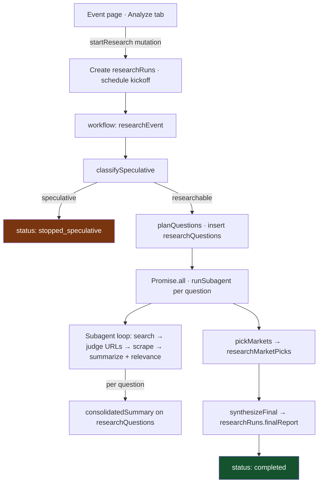

# Aperture

Next.js frontend with a [Convex](https://convex.dev/) backend. The app combines Polymarket event pages (markets, tabs) with an optional **durable AI research workflow** that classifies an event, plans questions, searches and scrapes the open web, then writes a memo plus recommended markets.

## Polymarket event research (Convex workflow)

Research runs entirely in Convex using **`@convex-dev/workflow`** (durable steps and retries) and **`@convex-dev/agent`** with **Mistral** for structured LLM calls. **Firecrawl** powers web search and scraping via existing Convex actions.



**Why this shape:** Workflow gives durable execution without rebuilding orchestration in LangGraph for this path. Agent threads persist LLM context for debugging and future features. The UI subscribes with `useQuery` to `researchRuns`, `researchQuestions`, sources, picks, and optional `researchLogs`—no SSE route required.

### Data model (Convex)

| Table | Purpose |
| --- | --- |
| `researchRuns` | One run per kickoff: `eventSlug`, status lifecycle, `speculativeReason`, `finalReport`, `errorMessage`, timestamps |
| `researchQuestions` | Planned questions with status (`pending` → `searching` / `scraping` / `summarizing` → `done` / `failed`), `iteration`, `consolidatedSummary` |
| `researchSearchResults` | Firecrawl search hits per question/iteration with scrape `decision` |
| `researchSources` | Scraped pages: URL, summary, `relevant`, `relevanceReason` |
| `researchMarketPicks` | Recommended market id, `side` (YES / NO / AVOID / WATCH), conviction, rationale, key risk |
| `researchLogs` | Debug feed: `phase`, `level`, `message` |

Indexes favor listing by `runId` / `questionId` for reactive queries.

### Code map

| Area | Location |
| --- | --- |
| Workflow definition | `convex/research/workflow.ts` |
| Classify + plan steps | `convex/research/steps.ts` |
| Per-question subagent loop | `convex/research/worker.ts` |
| Market pick + final memo | `convex/research/synthesize.ts` |
| Public API (mutations/queries) | `convex/research/api.ts`, `convex/research/queries.ts` |
| Convex components | `convex/convex.config.ts` registers `workflow` + `agent` |
| Analyze UI | `app/(main)/event/[slug]/_components/analyze-panel/` |

Authenticated users start a run from the **Analyze** tab; progress, sources, picks, and the markdown memo update live.

### Convex environment (server)

Set secrets in the Convex dashboard (or `npx convex env set`) so actions can call providers:

- `MISTRAL_API_KEY`
- `FIRECRAWL_API_KEY`

---

## Getting started

### Prerequisites

- [Bun](https://bun.sh/)
- A [Convex](https://convex.dev/) project
- API keys for the features you enable (see `.env.example`)

### Installation

1. **Clone the repository**

   ```bash
   git clone <your-repo-url>
   cd aperture
   ```

2. **Install dependencies**

   ```bash
   bun install
   ```

3. **Environment variables**

   ```bash
   cp .env.example .env.local
   ```

   Fill in at least:

   ```env
   NEXT_PUBLIC_CONVEX_URL=<your-convex-url>
   NEXT_PUBLIC_CONVEX_SITE_URL=<your-convex-site-url>

   MISTRAL_API_KEY=<your-mistral-key>
   FIRECRAWL_API_KEY=<your-firecrawl-key>
   ```

   For production/preview deploys, also configure `CONVEX_DEPLOY_KEY` as described in `.env.example`.

4. **Convex Auth (first-time)**

   ```bash
   npx @convex-dev/auth
   ```

5. **Run the app**

   ```bash
   bun run dev
   ```

6. **Open the app**

   [http://localhost:3000](http://localhost:3000)

The `predev` script runs Convex setup hooks; see `package.json` for `dev` / `dev:frontend` / `dev:backend` split.

---

## Other features

The same repo includes Convex-backed **companies**, **documents**, discovery jobs, and dashboard integrations (e.g. optional Finnhub / Alpha Vantage keys in `.env.example`). Those paths are separate from the Polymarket research tables above.
