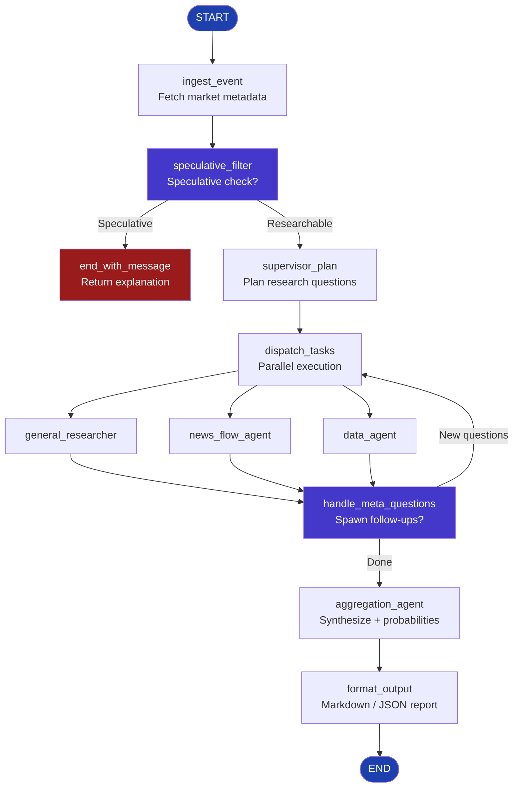

# Aperture

```mermaid
flowchart TD
    START([START])
    --> A[ingest_event<br/>Fetch market metadata]
    --> B[speculative_filter<br/>Speculative check?]

    B -->|Speculative| Z[end_with_message<br/>Return explanation]
    B -->|Researchable| C[supervisor_plan<br/>Plan research questions]

    C --> D[dispatch_tasks<br/>Parallel execution]

    D --> E1[general_researcher]
    D --> E2[news_flow_agent]
    D --> E3[data_agent]

    E1 & E2 & E3 --> F[handle_meta_questions<br/>Spawn follow-ups?]

    F -->|New questions| D
    F -->|Done| G[aggregation_agent<br/>Synthesize + probabilities]
    G --> H[format_output<br/>Markdown / JSON report]
    H --> END([END])

    style START fill:#1e40af, color:white
    style END fill:#1e40af, color:white
    style B fill:#4338ca, color:white
    style F fill:#4338ca, color:white
    style Z fill:#991b1b, color:white
```
